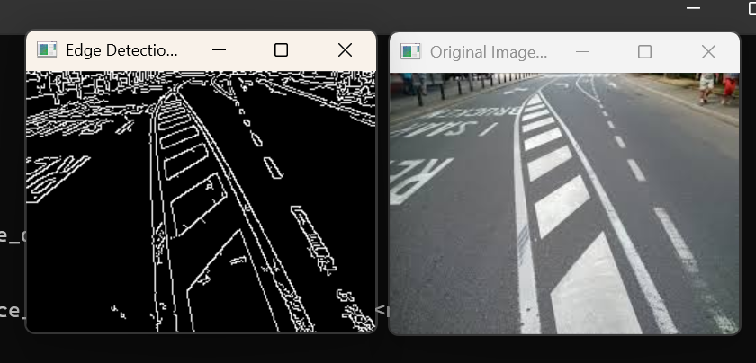

# Line Detection using Hough Transform

## Project Overview
This project demonstrates line detection in images using the Hough Transform technique in OpenCV. The program detects straight lines from an input image using edge detection and the probabilistic Hough Line Transform, then overlays these lines on the original image.

## Technologies Used
- Python 3.11
- OpenCV (cv2)
- NumPy

## How it Works
1. Loads the input image.
2. Converts the image to grayscale for simplicity.
3. Applies the Canny edge detector to find edges.
4. Uses the Hough Line Transform (`cv2.HoughLinesP`) to detect straight lines.
5. Draws the detected lines on the original image.
6. Displays and saves the final output image with detected lines.

## Installation

### Prerequisites
Python 3.11 or later.

### Install Required Libraries
pip install opencv-python numpy

## How to Run

1. Clone or download this repository and navigate to the folder:
cd project-4

2. Run the script:
python line_detection.py

3. The program will display the original image with detected lines drawn on it.
4. Press any key to close the window.

## Project Structure
project-4/
│
├── line_detection.py        # Main Python script
├── lines_sample.jpg         # Input image for line detection
├── output_line_detection.png  # Screenshot showing detected lines
└── README.md                # This file

## Output Screenshot
The screenshot below shows the image after line detection, with red lines drawn over detected edges.

## Applications
- Lane detection in self-driving vehicles
- Industrial part alignment and inspection
- Document edge detection
- Structural and architectural analysis
